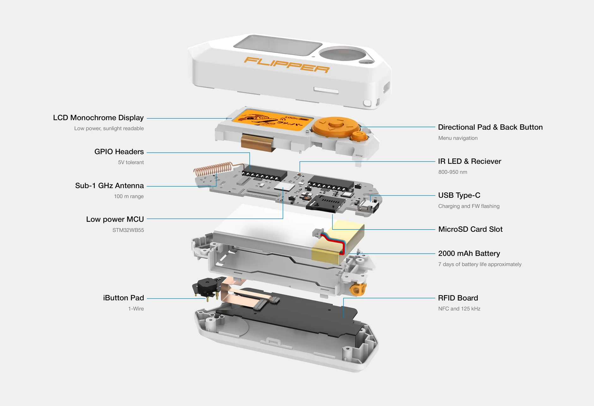

The **[Flipper Zero](https://flipperzero.one/)** is a modern, open-source hardware device that is designed to be a versatile and portable tool for cybersecurity professionals and enthusiasts. It is designed to be a great learning tool for anybody !

One of the key features of the Flipper Zero is its ability to run a wide range of software and tools for various cybersecurity tasks. It is equipped with multiple hardware components, allowing mostly to read/capture a signal, try to emulate it or cloning it onto antoher device, that can be used to access different control systems around you, such as :

- **Sub-1 GHz Transceiver**. For garage door, IoT sensors or else. The Flipper Zero is equipped with a 433MHz antenna and a CC1101 chip, making it a transceiver capable of up to 50 meters range. You can read signals from your garade remote and emulate it to open it.

- **RFID**. Low frequency proximity cards (125kHz), mostly used in old systems. This system has no form of authentication mechanism. It only checks the N-byte ID of the card. So it is easy to read the ID of the card, and emulate it with the Flipper Zero, or even clone it.

- **NFC**. High frequency proximity cards (13.56MHz), more modern. It works the same way as the RFID, so you can read, emulate and clone some NFC cards/badges. Not all though, as we will discuss in further articles dedicated to the Flipper Zero NFC module.

- **Bluetooth Low Energy 5.0**. The Bluetooth allows Flipper Zero to be a host and/or a pripheral device. You can connect it to your phone, and use the qFlipper application from iOS and Android to update your Flipper Zero. You can also use the Flipper Zero as a Bluetooth remote for your phone or computer, allowing you to use your Flipper Zero as a mouse or scrolling throught TikTok/YouTube Shorts.

- **Infrared Transceiver**. Works on TVs, air conditioners, projectors and more. A universal remote is available, with power on/off, changing volume or channel. It will go over every known signals to find the right one for your target. It also works as a receiver, allowing you to receive signals and save them in the Flipper Zero (from your own TV for example), to transmit commands later.

- **iButton 1-Wire**. Used in very old systems, so do not expect to find it in your new residence. The 1-Wire protocol does not have any authentication, so the Flipper Zero can easily read the IDs, copy them and emulate them.

- **GPIO**. For hardware exploration. The Flipper Zero can be connected to any hardware with GPIO to control it with buttons, run your own code and print messages to the screen.

- **USB 2.0, type C**. The Flipper Zero can be connected to devices using USB, allowing you to control your Flipper Zero from your desktop with the qFlipper application, update it, manage the files on your SD card. The Flipper Zero also works as a badusb. You can create several scripts written in ducky script, save them in your Flipper Zero and try them all you want.

In addition to its technical capabilities, the Flipper Zero is also designed to be portable and easy to use. It has a compact, pocket-sized form factor and a user-friendly interface that makes it easy for users to access and use all the tools and features.

One point that is extremely great for enthusiasts like us, is that the Flipper Zero is open source ! You can check their [GitHub](https://github.com/flipperdevices/flipperzero-firmware) to see how everything is done. It means, for the more technical people around here, that you can easily modify the source code of anything in the Flipper Zero and recompile it yourself. It also means that you can develop your own applications for the Flipper Zero and upload them onto your device. It provides a great flexibility and customization of your Flipper Zero, but beware : **anything that you do with the Flipper Zero is your own responsability !**

Overall, the Flipper Zero is a valuable tool for cybersecurity professionals and/or enthusiasts who need a versatile and portable device for their work. It offers a wide range of features and capabilities, as well as a user-friendly interface, making it an excellent choice for those looking to improve their cybersecurity skills and knowledge.